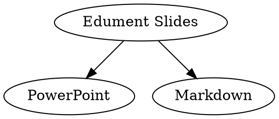

# Baseline 

**August 2015**

~

## State of the union

~

## PowerPoint

  

    

      <ul>
        <em>Pros:</em>
        <li>Quick to produce</li>
        <li>Decent looking</li>
       </ul>
    

    

      <ul>
        <em>Cons:</em>
        <li>Not diff-able</li>
        <li>Hard to collaborate</li>
        <li>Many versions problem</li>
        <li>Print version identical to slides</li>
      </ul>
    

  

Book:

While powerpoint presentations gave us the ability to quickly put together decent looking presentations,
they also lead to considerable issues with versioning and collaboration.  Also these presentations are
hard to maintain in the mid-longer term.  For example when we changed our logo and standardized our
colours it became difficult to update all of our old courses to our new styles.  Since we store all of
our courses in git repo's we should also be able to take advantage of gits workflow.

Ideally we want to allow for:
* Code/Slide Review
* Branching and Merging
* Updating all slide themes across all of our courses.

~

## Markdown (Beamer)

  

    

      <ul>
        <em>Pros:</em>
        <li>Quick to produce</li>
        <li>Decent looking</li>
        <li>Diff-able</li>
        <li>Easy to collaborate</li>
       </ul>
    

    

      <ul>
        <em>Cons:</em>
        <li>Some learning curve to be quick to produce</li>
        <li>Many versions of <em>generator</em></li>
        <li>Print version identical to slides</li>
        <li>Limited slide layouts</li>
        <li>Limited plugins</li>
      </ul>
    

  

Book:

While writing our slides in markdown using Beamer and a series of scripts made it easier to build
and maintain courses as a team this system also lead to several new issues.

The scripts for generating the presentation where stored in the same repo as the slides leading to
different course repo's having different versions of the generator.  Other issues included limited
plugins and layout options meaning that slides needed to conform to a specific style.