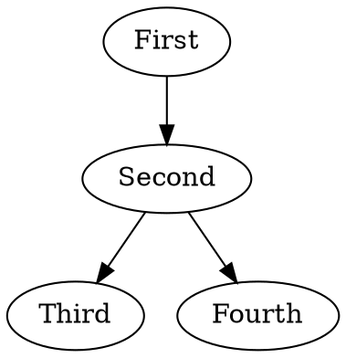

~

Every chapter/section starts with a title

```
---
title: Reveal.js
tagline: Leveraging existing OS projects
---
```

Book:
Theres also an optional "tagline" if you want to put it for chapters/sections.

~

You can add more slides with a **~**

```
---
title: Reveal.js
tagline: Leveraging existing OS projects
---

First Slide!

&#126;

Second Slide!
```

Book:
A &#126; goes in between each slide.

~

Book sections:

```
&#126;

This is in the slides! (and the book)

Book&#58;
This is only in the book!

&#126;

This is the next slide!
```

~

You can enable chewers with an mc2.config.js
```
var chewHighlight = require('mc2/dist/plugins/chewHighlight');
var ditaa = require('mc2/dist/plugins/chewDitaa');
var dot = require('mc2/dist/plugins/chewDot');

module.exports = {
    earlyChewers: [
        ditaa.chew,
        dot.chew,
        chewHighlight.early
    ],
    chewers: [
        chewHighlight.late
    ],
    delivery: "Edument Talk Day"
};
```
Book:
Checkout the MC2 documentation or bug David, Erik or Stephen if you need more info about chewers

~

Ditaa Drawings
<div class="container">
  <div class="row">
    <div class="col-md-6">
```
&#96;&#96;&#96;ditaa
+-----+
| One |
+-----+
   |
+-----+
| TWO |
+-----+ 
&#96;&#96;&#96;
```
    </div>
    <div class="col-md-6">
      <br>
```ditaa
+-----+
| One |
+-----+
   |
+-----+
| TWO |
+-----+ 
```
    </div>
  </div>
</div>
Book:
Automatically generating these drawings means we don't need to keep the resources checked into git.  It
also means that in the future these will be created with the different backgrounds/colours for print
vs presentations.
~
Dot Graphs
<div class="container">
  <div class="row">
    <div class="col-md-6">
```
&#96;&#96;&#96;dot
digraph SampleGraph {
  First -> Second
  Second -> Third
  Second -> Fourth
}
&#96;&#96;&#96;
```
    </div>
    <div class="col-md-6">

    </div>
  </div>
</div>

~

Lots of other extensions as well!

**Try them out at home!**

